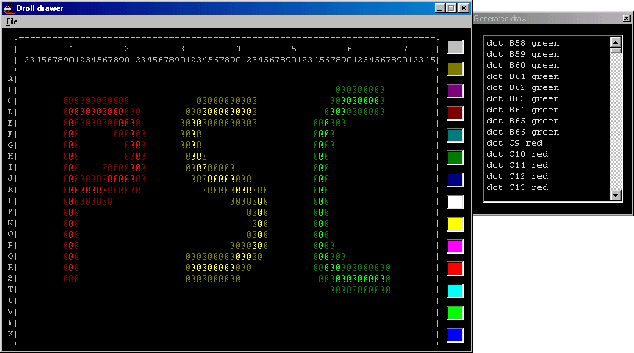



## Unqiue ASCII drawing program

### Description

I've made this program to a mud I played. In the game there was a drawing scroll, to draw on it I had to use annoying dot commands (e.g dot 1,1 white, dot 2,2 white bold) needless to say that because of the bother no one used this drawing scroll. That's why I did this program.

You use the mouse and the colors just as any simple drawing program to draw your picture, then you press "Generate Draw" (In the menu) and there you get it, all the dot commands are generated for you.

Enjoy the code, I am sure you will find it a good use =).
 
### More Info
 

             |
---                |---
**Submitted On**   |2001-03-06 15:51:08
**By**             |[Vitaly](https://github.com/Planet-Source-Code/PSCIndex/blob/master/ByAuthor/vitaly.md)
**Level**          |Beginner
**User Rating**    |5.0 (10 globes from 2 users)
**Compatibility**  |VB 5\.0, VB 6\.0
**Category**       |[Graphics](https://github.com/Planet-Source-Code/PSCIndex/blob/master/ByCategory/graphics__1-46.md)
**World**          |[Visual Basic](https://github.com/Planet-Source-Code/PSCIndex/blob/master/ByWorld/visual-basic.md)
**Archive File**   |[CODE\_UPLOAD170893152001\.zip](https://github.com/Planet-Source-Code/vitaly-unqiue-ascii-drawing-program__1-21653/archive/master.zip)

